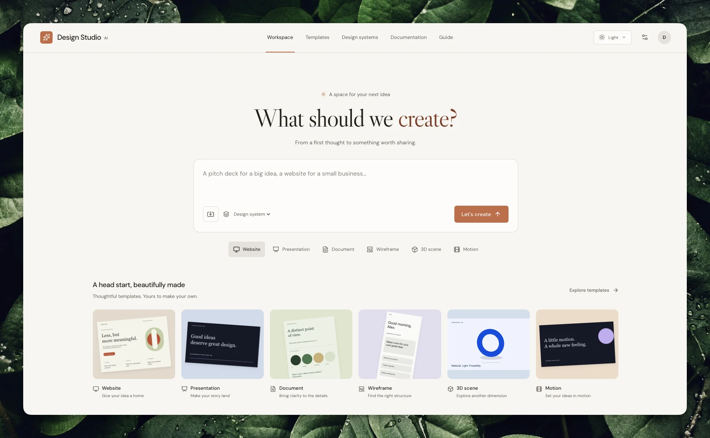
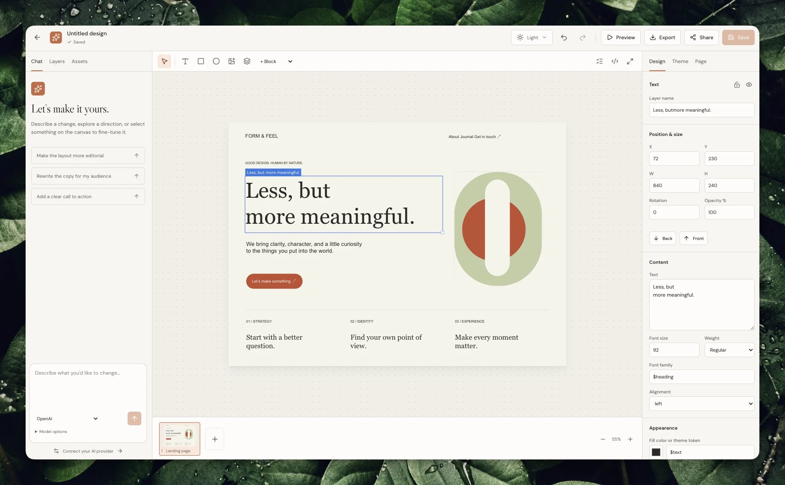
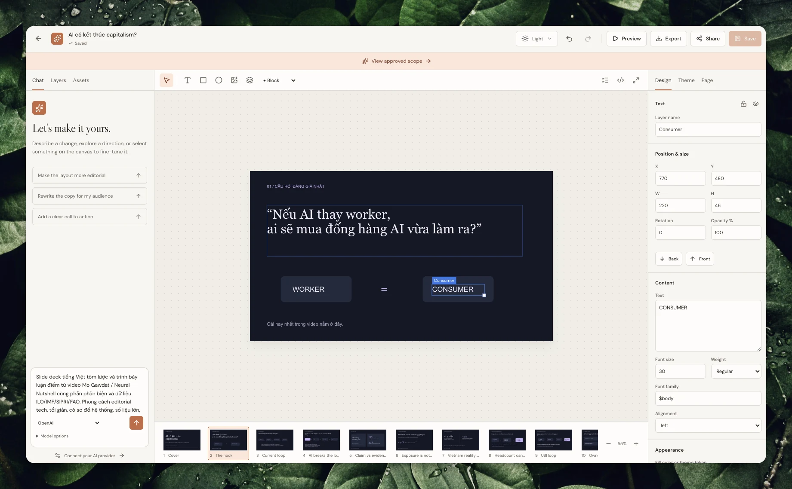
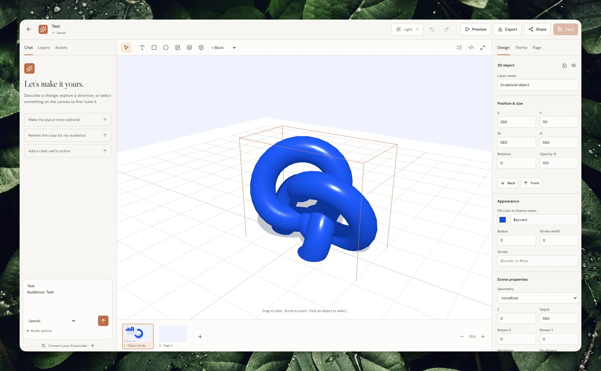

# Design Studio AI

[Open the studio](https://studio.agentkit.best) · [Guide](https://studio.agentkit.best/guide) · [Documentation](https://studio.agentkit.best/docs) · [Source](https://github.com/bestagentkits/design-studio-ai) · [MIT license](LICENSE)

An agent-first design workspace for web interfaces, slides, reports, wireframes, 3D scenes, and timeline videos. Start with a brief or template, inspect the preview, make focused changes through chat or the manual editor, and export or publish the result. People and agents work on the same versioned document.



## Capabilities

- Responsive project library with search, filters, sorting, duplication, and saved designs.
- Structured flex/grid layouts, nested groups, Ant and shadcn-style components, versioned reusable design systems, and live human/agent editing.
- Native [2D character motion](docs/character-motion.md): bones, skins, weighted meshes, per-property clips, constraints, physics and scene blending.
- [Editable 3D characters](docs/3d-characters.md): remesh/loft, quadruped rigs, weights, IK, morph targets and UV painting; textured animated 3D scenes, multi-layer keyframe editing, presentation modes, font/model discovery and interactive API docs.
- BYOK text, image, speech, music/effects, and video generation, plus supported source-media edits. See [providers](docs/providers.md).
- JSON, HTML, SVG, PNG, PDF, PowerPoint, WebM, supported MP4 recording, React prototype ZIP, GLB/glTF, and authorized Google Slides export.
- Immutable public snapshots, REST, authenticated Streamable HTTP MCP with OAuth/API keys, experimental browser WebMCP, and the `dsa` CLI with an [agent skill](skills/design-studio-ai/SKILL.md).
- Owner-scoped activity, correlated request/provider traces, and reported token/cost usage with explicit coverage; optional operator views and PostHog forwarding. See [activity and configuration](docs/deployment.md#activity-retention-and-optional-posthog).
- Cloudflare hosting or Docker self-hosting with persistent SQLite/files.
- Email/password and optional GitHub sign-in, with explicit account linking in Settings.
- Persisted contextual interviews, editable scopes, explicit approval, and shared REST/MCP/CLI/WebMCP access to the same brief.
- System/light/dark appearance, keyboard-friendly mobile controls, and design checks that locate likely text overflow, missing media, and contrast issues without changing the canvas.
- Searchable API/CLI/connection documentation, a visual beginner guide, crawlable HTML, Markdown, sitemap, and llms indexes.

Generation calls real providers and requires your credentials and account access. It returns a proposal or asset; saved designs change through explicit revision-checked writes.

## Inside the studio

<details>
<summary>Web, slide, and 3D editing</summary>

**Web layouts** — edit the canvas and typography alongside the conversation.



**Slides** — refine individual elements while keeping the presentation in view.



**3D scenes** — inspect objects, materials, and composition in the interactive scene.



</details>

## Run locally

Use Node.js 24 or newer:

```sh
npm ci
npm ci --prefix packages/cli
npm run build:cli
npx playwright install chromium
npm run build
```

Set a stable random 32-byte base64 `ENCRYPTION_KEY` in the server's process environment, and set `APP_URL=http://localhost:8787`. Generate a key once with:

```sh
node -e "console.log(require('node:crypto').randomBytes(32).toString('base64'))"
```

Keep the key with your deployment secrets; changing it prevents decryption of existing provider keys. [Deployment instructions](docs/deployment.md#local-node) include shell examples. `npm start` does **not** automatically load dotenv files.

```sh
npm start
```

Open [localhost:8787](http://localhost:8787). SQLite and assets persist under `DATA_DIR` (default `data`). For development, run `npm run dev:api` and `npm run dev` in separate terminals with the same server environment; Vite serves [127.0.0.1:5173](http://127.0.0.1:5173) and proxies the API.

## Docker

Set `ENCRYPTION_KEY` and the public `APP_URL` in your environment or a local Compose `.env`, then run `docker compose up --build -d`. The container binds to `0.0.0.0:8787`. [compose.yaml](compose.yaml) persists database/assets in `studio-data` at `/data`. Use HTTPS at your reverse proxy for an internet-facing installation. See [deployment and backups](docs/deployment.md).

## Agent access

Create an API token in Settings and inject `DESIGN_STUDIO_API_KEY` into the agent environment. `DESIGN_STUDIO_URL` defaults to the live studio. Network MCP is at `https://studio.agentkit.best/mcp`, with OAuth discovery on the same origin.

Install the published [v0.4.0 release](https://github.com/bestagentkits/design-studio-ai/releases/tag/v0.4.0) CLI tarball:

```sh
npm install -g https://github.com/bestagentkits/design-studio-ai/releases/download/v0.4.0/bestagentkits-design-studio-ai-0.4.0.tgz
dsa --help
```

The package is **not published to the npm registry**. To build and install from this checkout instead:

```sh
cd packages/cli
npm pack
cd ../..
npm install -g ./packages/cli/bestagentkits-design-studio-ai-0.4.0.tgz
dsa --help
dsa schema
dsa projects list
```

The release also includes the [installable agent skill ZIP](https://github.com/bestagentkits/design-studio-ai/releases/download/v0.4.0/design-studio-ai-skill.zip). [Agent documentation](docs/agents.md) covers revisions, secret handling, exports, and skill installation.

## Verify and contribute

Start with the [contributor documentation](docs/README.md) to find the owning guide and source for your change. Coding agents should follow [AGENTS.md](AGENTS.md).

Run `npm run typecheck`, `npm test`, and `npm run build`. `npm run test:e2e` starts an isolated temporary test server and runs desktop/mobile Chromium workflows; see the [test runner](scripts/run-e2e.mjs). Tests use real local persistence and inspect format content. Follow [architecture](docs/architecture.md) when changing public contracts; do not add a second document format for a client.

## Current boundaries

- Provider/Google success needs external credentials and was not live-verified in the initial delivery environment. Missing configuration returns useful errors.
- Google Slides accepts native text/shapes and HTTPS images; unsupported complex nodes fail explicitly. PowerPoint keeps editable text/primitives and rasterizes complex content.
- Cloud binary export requires imported project assets for remote media, enforces render-size bounds, and limits motion to 60 seconds. MP4 depends on an available encoder. SVG is static; HTML can include the trusted interactive scene/timeline viewer. See [export behavior](docs/architecture.md#rendering-and-export).
- Cloud motion mixes imported audio/video; browser fallback recordings are silent. Serialized camera, lights, mesh/UV data, materials and rigs persist. Live synchronization polls saved revisions every 1.2 seconds.
- WebMCP is experimental and feature-detected; other browsers retain the human UI and network MCP.
- Upstream dependency audit findings remain; see [security notes](docs/deployment.md#dependency-security).

[Product brief](docs/product-brief.md) records the requested scope. [Release verification](https://github.com/bestagentkits/design-studio-ai/blob/1a23d4a4a4ca4c14c6c15f2ae7318004a908ce2b/plans/2026-09-07-bootstrap-design-studio-ai/reports/release-v020.md) records the observed checks and limitations for v0.2.0. [Initial delivery evidence](https://github.com/bestagentkits/design-studio-ai/blob/1a23d4a4a4ca4c14c6c15f2ae7318004a908ce2b/plans/2026-09-07-bootstrap-design-studio-ai/reports/finalization.md) remains available for v0.1.0.

Discover and share reusable designs in [Community](https://studio.agentkit.best/community). [Community documentation](docs/community.md) covers publishing, portable downloads, independent remixes, contextual search and moderation.
