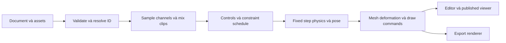

# Thiết kế đề xuất và ranh giới

Status: proposed. Đây là kế hoạch implementation, không phải hợp đồng sản phẩm hiện tại.

## Outcome và scope

Một mascot gồm hình nhiều lớp có rig dùng lại; người dùng tạo clip, điều chỉnh bằng UI hoặc ngôn ngữ tự nhiên, đặt nhân vật trong website/slide/video, rồi xuất được kết quả thực. Toàn bộ nhóm chức năng trong tư vấn được giữ trong 10 phase.

Không mặc định làm trình biên tập game hoàn chỉnh, motion capture, lip-sync tự động, plugin Unity/Godot hoặc thay thế toàn bộ Spine. Việc yêu cầu chúng sau đó mở rộng nhánh tương ứng; không được dùng YAGNI để cắt tính năng đã xác nhận. “Giống khả năng Spine” không đồng nghĩa với đọc `.spine` hoặc tương thích binary/JSON của Spine.

## Evidence và lựa chọn runtime

- [Timeline hiện tại](../../src/app/timeline-editor.tsx) dùng keyframe gom nhiều thuộc tính và chung easing; [interpolation](../../src/shared/render.ts) duy trì legacy semantics.
- [Scene runtime](../../src/shared/scene-runtime.ts) phục vụ Three.js 3D; không tự thêm bone index vào 2D image và coi đó là rig 2D hoàn chỉnh.
- Đề xuất evaluator 2D độc lập renderer; tận dụng Three.js đang có cho textured triangles bằng orthographic camera/unlit materials nếu spike đạt thứ tự lớp, clipping, alpha và mixed DOM/3D composition.
- Spike so sánh tận dụng Three.js với một backend 2D chuyên dụng nếu bằng chứng cho thấy cần. Chưa thêm dependency mới; chốt bằng prototype hình thực và tài liệu chính thức hiện hành. Không fork Spine runtime mặc định.
- Canvas2D fallback phải vẽ được cùng tam giác/texture/clipping hoặc hiển thị poster kèm giới hạn rõ ràng; poster không được tính là full playback parity. Không hạ chất lượng im lặng.

## Data model và compatibility

Đề xuất document v2 là extension có version rõ ràng; v1 vẫn đọc, sửa, xuất như trước. Một canonical document cho mọi client, không có định dạng JSON riêng cho MCP/CLI. Phase 1 chốt trường chính xác trước Phase 2.

| Entity dự kiến | Nội dung / invariant |
| --- | --- |
| `characters[]` | Rig definitions với ID ổn định; nhúng trong document để hoạt động offline |
| `bones[]` | ID, parent ID, setup transform, length; cây không chu trình; pixels/degrees theo quy ước document |
| `slots[]` | Gắn bone, attachment mặc định, blend mode và thứ tự vẽ có ID |
| `attachments[]` | Region/mesh/sequence/clip polygon/bounds; ảnh chỉ tham chiếu `assetId` trong `doc.assets` |
| `skins[]` | Ánh xạ slot→attachment; mesh linkage có identity và không chu trình |
| `clips[]` | Duration/loop, property channels, keys có ID, event markers; target bằng bone/slot/constraint ID |
| `constraints[]` / `controls[]` | IK, transform, path, physics, slider; dependency graph có thứ tự xác định |
| Character node/instance | Character ID, skin ID, local transform, instance overrides; pose tính toán không lưu |
| Composition placements | Clip ID + instance ID, start/end, source range, speed, loop, weight, mask, blend mode |

Không gắn semantic của rig vào `node.data: unknown`. Array geometry/UV/weights coi là một khối conflict; xương/clip/key được merge theo ID. Reorder chỉ đổi thứ tự hiển thị, không đổi animation target. Xóa entity đang được dùng phải báo references và yêu cầu operation rõ ràng; không tự bỏ dữ liệu.

Đề xuất numeric keys có easing theo channel/segment; attachment/draw-order/events là discrete. Rotation có quy tắc shortest-path hoặc unwrapped nhiều vòng rõ ràng. Sparse channels có setup fallback; trước/sau clip và boundary loop phải xác định.

### Rollout version an toàn

1. Bổ sung reader/validator v1+v2 và capability discovery trước khi bật tạo v2.
2. Tất cả browser/CLI/provider/export/package runtime phải đọc v2; giữ old documents là v1 cho đến hành động nâng cấp rõ ràng.
3. Mọi write trên project v2 phải khai báo version/capability đã đọc. Server kiểm tra raw schemaVersion trước Zod stripping, và từ chối downgrade v2→v1 dù revision hiện tại đúng.
4. Provider prompt hiện ghi v1 phải được cập nhật; đầu ra sai version không được lưu. Export JSON giữ version nguồn.
5. Nếu lỗi rollout: tắt tạo/chỉnh capability mới, giữ reader v2 và byte dữ liệu hiện có. Không rollback server về build chỉ đọc v1 sau khi đã có v2; không downgrade mất dữ liệu.

## Evaluation pipeline

Evaluator không DOM, network, wall-clock hoặc user JavaScript. Một compiled rig/cache theo revision; playback update buffer thay vì clone document/rebuild scene mỗi frame. Mọi constraint phụ thuộc dữ liệu phải nằm trong schedule đã compile; reject chu trình slider↔clip hoặc constraint. Không áp dụng skinning 3D và 2D lên cùng node.

Pose sliders sample một pose clip có miền giá trị xác định, không tự kích hoạt timeline events hoặc recursive playback. Giải quyết thứ tự controls/constraints trong schedule; thứ tự trong sơ đồ chỉ là các bước khái niệm, không thay dependency graph.

Physics dùng timestep cố định đề xuất 1/120s, seed/config ổn định và reset/snapshot khi seek. Mỗi seek/export bắt đầu từ trạng thái gốc hoặc checkpoint đã xác minh cùng revision; cấm lấy trạng thái còn sót của lần preview trước. Giới hạn replay work để seek 60 giây không treo UI.

Clip local time khác composition time. Blending transform trên pose, sau đó solve constraints; mask theo bone subtree. Events xử lý khoảng thời gian tiến tới, loop và instance; seek chỉ xem hình, không bắn lại event tác động bên ngoài.

## UX contract

Setup / Animate / Compose là các mode rõ ràng. Setup sửa rig gốc, Animate tạo/chỉnh keys của clip, Compose bố trí instance và clip trên timeline scene. Auto-key có indicator; kéo thử trong preview không ghi dữ liệu. Một gesture là một undo transaction.

Tree bên trái, canvas ở giữa, inspector bên phải, dopesheet/graph phía dưới; mobile dùng các panel theo ngữ cảnh. Tất cả drag có thao tác số/nút thay thế; hỗ trợ keyboard, IME, touch, reduced motion, light/dark và focus restore theo editor hiện tại.

Rig diagnostics điều hướng tới bone/mesh thiếu asset, weight sai, constraint cycle. Hiện thời lượng clip và scene riêng. Import nhiều ảnh dùng cùng coordinate origin/pivot; không tự đoán tọa độ ảnh đã crop nếu thiếu manifest: cho người dùng chỉnh.

## AX và AI

Public thao tác theo capability, không theo tọa độ UI: inspect/create/update rig; attach/skin; clip/channel/key CRUD; mesh/weights; constraints; place/mix clip; sample pose; preview proposal; export. Tên operation cụ thể được khai báo tại shared schema, không sao chép thành schema riêng từng client.

Mỗi phase đưa operations, server ownership/revision, discovery và docs của capability đó vào cùng thay đổi. Phase 8 thêm ngữ nghĩa prompt/proposal và workflow hoàn chỉnh, không phải lúc bắt đầu expose agent API.

AI nhận subset rig + clip cần thiết và brief đã duyệt, trả operation proposal có base revision; validate → tính preview → diff → apply đúng revision. Không tự approve brief, sửa saved document, publish hoặc retry bằng revision mới. Tách asset-generation permission/cost khỏi chỉnh keyframe thuần dữ liệu.

## Asset và export contract

Attachments chỉ giữ asset IDs giúp server kiểm tra tất cả bytes qua `doc.assets`. Nhưng clone phải remap asset IDs lẫn rig/clip/instance references; publish phải resolve từ snapshot asset table; remove/unused assets phải hiểu character graph. Không phụ thuộc project nguồn khi import portable package.

Native package: versioned manifest + canonical document subset + owned image bytes + trusted player/build metadata. ZIP kiểm tra path traversal, tổng bytes giải nén, file count, signature và reference graph. PNG sequence/spritesheet ghi frame order, fps, bounds, trim/pivot và alpha; không gọi spritesheet là editable rig.

HTML/React dùng runtime chính thức của Studio; source export phải cập nhật allowlist module/dependency trong build script. Video dùng frame evaluator chung nhưng encoder/capture là lớp khác: deterministic pose không tự chứng minh file video không drop frame. Kiểm tra decoded output theo timestamps. Giữ cap cloud 60 giây và MP4 capability detection.

Static SVG cho region attachments có thể native; mesh/clip phức tạp dùng snapshot raster có thông báo, không bỏ node. PPTX/PDF raster phần nhân vật tại frame đã chọn; Google Slides chỉ dùng ảnh với authorization hợp lệ hoặc lỗi unsupported. GLB/glTF giữ hành vi 3D hiện có; nếu scene có nhân vật 2D không thể biểu diễn thì báo rõ, không silently omit.

## Các lựa chọn cần xác nhận trước nhánh tương ứng

- Đầu ra game: engine nào, embedding API nào, runtime interaction/bounds cần tới đâu? Có thể triển khai native Studio mà chưa quyết định adapter.
- Tương thích Spine: import, export hay round-trip; phiên bản; yêu cầu license. Không mặc định đầy đủ parity từ “giống tính năng”.
- PSD: có cần import/reimport layer offsets và tên xương không, hay PNG + manifest đủ cho đầu vào đầu tiên?
- Thiết bị tối thiểu/performance target: đề xuất trong test matrix cần đo ở Phase 1, không phải số liệu đã đạt.

## Nguồn tham khảo đã đọc trong phiên

- [Spine features](https://en.esotericsoftware.com/spine-in-depth): bones, graph, IK/path, skins, mesh/weights và asset workflow.
- [Runtime demos](https://en.esotericsoftware.com/spine-demos): mixing, attachment swaps, clipping và runtime posing.
- [Spine 4.3](https://esotericsoftware.com/blog/Spine-4.3-released): pose sliders, transform mappings và playback controls.
- [Runtime license](https://en.esotericsoftware.com/spine-runtimes-license): tích hợp Spine runtime cần kiểm tra điều kiện riêng; không giả định MIT.

Nguồn này là tham chiếu hành vi; implementation native không sao chép mã hoặc asset độc quyền.
