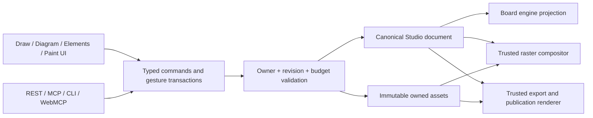

# Proposed Board and Paint architecture

Status: planning design. Engine adoption is conditional on Phase 01 evidence. This document does not describe implemented features.
Scope and device decisions: [intake](reports/intake-and-source-map.md). Source evidence: [contracts](research/contracts.md), [engines](research/engines.md). Completion criteria: [acceptance matrix](acceptance-matrix.md).

## Decisions and trade-offs

Use one Studio document with typed Board and Paint sections, one user-visible edit history per project session, and shared server write services. Excalidraw is the first MIT Board interaction candidate. Its scene is an in-memory projection, not another durable authority. Native SVG/Canvas geometry and permissively licensed libraries are the fallback if required round trips, input, history or rendering cannot be implemented cleanly.

| Approach | Load-bearing assumption | Where it fails first | Response |
| --- | --- | --- | --- |
| Excalidraw adapter | Released public APIs can project every required Board property and coordinate history/GIF/Paint surfaces without losing semantics. | Native undo cannot be integrated, required vector/custom element interaction requires an invasive fork, or z-order/animation cannot stay correct. | Fail adoption, retain test corpus/canonical model and use native renderer/interaction implementation. Re-estimate effort; no scope cut. |
| Native SVG/Canvas Board | We can fund and test selection/camera/text/accessibility details to reference quality. | Interaction quality and device latency cost more work than initial estimate. | Iterate against recorded workloads; do not relabel a basic drawing demo as parity. |
| Dual independent SDK editors | Users and agents can tolerate separate scenes/history/exports. | Moving content or applying agent edits loses meaning/history. | Rejected: conflicts with the shared-document product architecture. |

Better approach than rebuilding every interaction immediately: evaluate a mature MIT editor against an explicit adapter contract, keeping the switch cost bounded to the interaction/render layer. Evidence is the documented Excalidraw integration API; adoption remains unproven. tldraw SDK is excluded from the dependency path by the user's license preference. ELK.js is EPL-2.0 and is not a default MIT choice; investigate Dagre plus native routing/tree/radial layout first.

## Ownership and data flow

Client gesture drafts render immediately. Persisted writes occur only at bounded transaction boundaries. Browser-only local edits are visibly distinct from server-saved state. Session state includes selection, current tool, pan/zoom, brush cursor and transient caches; these are not serialized into server project history.

## Canonical versioning

- Keep valid v1 documents in v1 until a new Board/Paint feature is actually committed. Read both versions through explicit branches; do not parse v2 with a v1 schema that strips fields.
- Introduce canonical v2 with a shared pure v1-to-v2 upgrade. Preserve existing IDs, layouts, kind, metadata semantics and content; a new standalone Board project uses the new `board` kind. Existing slides remain slides when embedding a board.
- Save/merge inspect stored version as well as supplied version and expected project revision. A v1 PUT/merge cannot replace an upgraded v2 project, even if the old client has a current numeric revision. Unsupported versions receive actionable errors.
- Bind the version decision and CAS to the same observed row revision. Reject a caller's expected revision if it differs from that observation; do not check version against an old read and later commit against a caller-guessed future revision.
- `/api/schema`, CLI schema output, MCP resources and browser capability discovery advertise supported versions and typed new operations. Existing GET consumers may fail to understand a newer document; they must receive its true version, never a silently flattened or stripped v1 view. Updated UI/CLI explain upgrading the client.
- Stage rollout as v2-capable readers/validators/renderers first, new-feature writes second. A rollback after v2 data exists must retain the v2-capable reader baseline; do not deploy an old v1-only binary over upgraded data. Preserve immutable publication versions; no bulk rewrite.
- Document JSON evolution alone does not require a SQL table rewrite. Add new migrations only for required asset staging/pinning/job metadata. Never modify applied migrations or regenerate the encryption key.

## Board model

Proposed root `boards[]` has stable IDs and typed, ordered `elements[]`. Existing page `nodes[]` gain a `board` node with `boardId` and explicit crop/view bounds. A standalone Board document uses a page containing this node; multiple embedded instances can view the same board with separate crop rectangles. Ordinary duplicate creates independent content by default; linked insertion is an explicit choice. No recursive board embedding.

Element payloads cover freehand stroke, editable vector path, shape, text, group/frame, connector, owned image/sticker/emoji/GIF and painting reference. Required visual fields include roughness/seed where applicable, stroke/fill, pressure samples, transform, visibility/lock and stable order. Pin renderer semantics/version for seeded geometry. SDK IDs map to canonical IDs; typed visual fields may preserve necessary engine styling, but an opaque SDK blob is not the document.

Board world coordinates are finite and validated independently of finite page/export dimensions. An unbounded-feeling camera does not allocate an enormous canvas. View culling uses content geometry; export always selects finite artboard/crop/content bounds with existing pixel limits. Board content inside web flex/grid is positioned within its embedding node and cannot move surrounding DOM layout during pan/zoom.

Connector endpoints bind to element IDs and normalized anchors/ports. Store routing mode, user-authored bends, arrowheads and labels; compute transformed endpoints from canonical geometry. General graphs support cycles/self-loops where appropriate; only mind-map parentage and group nesting must be acyclic. Default deleting an endpoint also deletes its incident connector within one undoable transaction; explicit detach preserves a free endpoint before deletion. Collapsed mind-map branches remain stored and hidden by presentation state. Layout respects pinned nodes, manual bends and selection boundary; async results carry the source revision/selection generation and are discarded when stale.

All diagram families use the same primitives and shared semantic operations. DAG layout is not sufficient for ports, arbitrary cyclic graphs, obstacles or radial trees by itself; test routing and provide bounded native strategies. Do not name four template cards while delivering only one graph behavior.

## Paint model and runtime

Proposed root `paintings[]` stores dimensions, color space, algorithm version, ordered layers and masks. A board painting element or existing design artwork node references a painting ID. Editable truth is immutable layer pixel assets plus typed manifests/settings. Composite previews are derived, identified by a hash of all contributing layer/tile/mask/settings versions.

- Start with sparse persisted 512x512 lossless tiles, registered through the existing asset identity/ownership system. Smaller dirty regions may exist in RAM. Tile records are atomic: ID, position, dimensions, immutable asset ID and generation/hash cannot be merged independently.
- Brush algorithms cover tip/grain, pressure/tilt, spacing, flow, opacity, ink taper, texture and actual color pickup/deposit/smudge. Define the initial color model explicitly (sRGB interchange, specified premultiplied-alpha/compositing and mixing math) and test known input/output pixels. Physical pigment-fluid simulation is outside this request.
- Layers support opacity/order, a defined blend-mode list, groups, masks, alpha lock and clipping; include multiply/screen/overlay and normal at minimum. Selection/fill/eraser honor locked content, masks and sample-visible-layer settings.
- A transient stroke command can be retained for recovery/retry with algorithm version and seed. It is not a second long-term source of pixels, nor a promise that every historical stroke remains individually editable after checkpointing.
- Use one trusted brush/compositor algorithm in the browser and the existing isolated server/headless-browser runtime for semantic agent painting. Server execution resolves owned bytes, validates finite commands and resource budgets, renders real pixels, stages assets and CAS-commits. Never accept user JavaScript or arbitrary shaders.
- Feature-detect input, worker and GPU capabilities. Pointer capture, coalesced-event fallback and cancellation are explicit. Do not rely on WebGPU or claim browser palm rejection without physical-device evidence. If a capability cannot run, retain readable/exportable artwork and a clear recovery path; normal painting still must pass the primary-device gate.

## Atomic writes, conflict handling and recovery

Each gesture owns an immutable base revision/generation and a separate local delta. A live-sync request started before the gesture may finish during it: queue or reconcile that response without replacing the gesture's sampling source or restoring a stale whole-document snapshot. Completion rebases only independent edits through shared validation; a changed painting source conflicts. Cancellation discards only the local draft and then presents the latest committed state. Smudge samples its fixed source generation for the whole transaction.

For each persisted paint action: validate request/ownership -> read expected painting generation -> budget decoded pixels/bytes/assets -> compute pixels in trusted runtime (or validate uploaded browser results) -> upload immutable dirty tiles -> atomically CAS document/layer manifest -> acknowledge the committed revision. If document CAS fails, do not publish the result as saved. Staged tiles are recoverable/collectable, never references to absent bytes.

Each new paint transaction has an owner/project-scoped operation ID and canonical payload hash. Persist its terminal receipt atomically with the document transition. A retry with the same ID/hash returns the committed result; the same ID with different payload is rejected. After a lost response, query/retry that ID before recomputing or applying another smudge. Pending/expired attempts have an explicit status; an expired uncommitted attempt cannot later publish its staged output. This is required for pixel-producing transactions, not a blanket rewrite of all existing endpoints.

Use a conservative painting-wide generation boundary for pixel-producing transactions initially. Color mixing can read neighboring tiles or other visible layers; same-painting concurrent pixel/settings writes conflict explicitly. Different paintings and independent Board edits may merge if their references/settings are unchanged. Finer disjoint-tile merging is optional only after read-dependency correctness is proven; it is not required for the first release. Generic recursive field merge is insufficient for coupled connector state and paint manifests.

One completed gesture is one history entry. Keep dirty buffers and binary pixels out of 80 cloned JSON snapshots. History records reference immutable assets and bounded transaction metadata. An SDK-originated edit and its programmatic projection must not produce duplicate history entries. Remote updates cannot become local undo entries or be erased by undo; retain the existing explicit notice when an incompatible history entry is removed.

Undo restores content through a new validated transaction, not old concurrency identity. Painting generation increases on undo/redo as well as forward edits. Once a project is v2, pre-upgrade undo snapshots are converted to v2; undo must never restore schemaVersion 1 or reuse a generation that an in-flight job still targets.

Draft recovery may use IndexedDB keyed by owner/project and base revision. On logout/account switch, remove private recovery material or isolate it so a later account cannot read it. Recovery never silently overwrites a newer server revision. Show pending/uploading/saved/conflict states; interruption keeps last committed source and offers recoverable draft explicitly.

## Asset lifecycle and limits

Create one typed collector/remapper for legacy `node.src`, registered asset URLs, existing 3D texture IDs, new Board elements, painting tiles/masks/brush resources and derived previews. Use it for validation, duplicate, clone, import, publication and export. Do not recursively replace all strings. New references are asset IDs resolved through the document asset registry and project ownership, not arbitrary nested URLs.

512px tiles keep the sample 2048²/12-layer workload at 192 fully painted tile assets; 4096²/24-layer is 1536 before masks/previews/other media. The existing 2000-asset cap still applies. Preflight projected live refs, decoded pixels, per-file/request bytes and storage use before resize/duplicate/import/stroke. Do not increase every global cap to fit one sample. Sparse tile loading and a bounded CPU/GPU cache are required; fully loading every layer of the desktop workload is not an iPad strategy.

The current 20 MiB asset, 21 MiB HTTP body and 30 MiB embedded-export limits are distinct. Base+local merge payloads must fit the body bound. Existing count limits count all reachable new content, not only top-level page nodes. Add frame-count/duration/decoded-pixel limits for GIFs and dimensions/decoded-pixel bounds for image/tile uploads before expensive decode. Signature checks alone are insufficient for new resource-heavy features.

Quota admission atomically reserves capacity per owner/project including in-flight uploads, pixel jobs and retained staged bytes. Reject before work when committed plus reserved usage exceeds limits; release reservations after finalization/failure, and expire abandoned reservations with a tested lease rule. Recheck lease/generation at commit so expiry cannot permit a late job to exceed budget. A read-only preflight estimate alone is not enforcement under concurrency.

Reserve an execution slot as well as bytes, with per-owner and installation-wide limits, a bounded queue and a wall-clock deadline. Cancellation closes the browser/worker and releases the lease; a timed-out task cannot later commit. These controls cover new paint processing and relevant new export work without weakening existing rate limits.

Implement lifecycle in two stages: first retain immutable committed tile assets conservatively; only enable deletion after reference/pin tracking is implemented and tested. Track staged uploads with expiry and history/recovery leases, and protect current projects, publications and in-flight commits. GC must recheck these protections against concurrent commits before deleting bytes. Missing/expired draft assets are reported, not substituted with blank pixels. No automatic deletion of committed-but-unreferenced assets until retention/undo semantics are documented. Bound retained storage with quota notices and explicit history expiration rather than accidental loss.

## Elements and exports

Bundle a small licensed searchable sticker/emoji catalog and search owned GIF/uploads. Preserve attribution/provenance for artwork separately from package licenses. Third-party GIF search is not required; no default GIPHY proxy/cache dependency. SVG imports must become validated supported paths or rasterized assets with a fidelity notice; never execute uploaded SVG markup. Emoji retains semantic Unicode plus the chosen visual asset so appearance is consistent.

GIF playback is application-controlled. Preserve original bytes and decoded timing/disposal/transparency semantics, use a selected poster in static outputs and timeline sampling for motion. An overlay must obey the same z-order, clipping, transforms and hit-testing as vector elements; inability to do this is an engine rejection signal, not a reason to flatten the animated requirement.

Static export builds a rendering projection containing only needed page/board/artwork assets and validated derived composites. It must not embed all editable/historical paint tiles when a bounded composite suffices. A supplied composite is never trusted without matching its source generation; regenerate or fail clearly. Server exports use trusted code, owner-scoped bytes and disabled external fetches; publications use snapshot-scoped bytes and never fetch private project URLs. The exact format matrix is owned by [acceptance](acceptance-matrix.md), including truthful Google Slides and GLB/glTF limitations. Existing JSON is not silently redefined as an asset archive.

Publishing exposes only the public rendering projection and its reachable asset set. Never serialize hidden Board elements, original masked paint pixels, source layers, brush commands or private recovery metadata into public HTML/viewer JSON, or grant public asset access to those sources. Flatten paint into the verified composite for public delivery while the private project retains editable layers. Inspect both HTML payload and asset-route accessibility; hiding layers visually is not data isolation. Preserve existing intentional publication behavior outside the new Board/Paint data paths.

Distinguish explicit visibility exclusion from mind-map collapse. Collapsing is a presentation control, not a privacy mechanism: descendants intentionally included in an interactive published map may remain expandable. Explicitly hidden content and underlying paint pixels are excluded. HTML/React files intended for sharing use the same source-exposure policy and disclose it before export.

## API, documentation and delivery

Existing design-system token application and v1 composition insertion must preserve v2 root content. Initial reusable-library capture explicitly rejects Board/Paint-dependent compositions before saving, with a capability explanation; editable embedding remains fully supported. Do not silently strip root references or add a new portable library package contract in this feature.

Extend shared font discovery to reachable Board text and connector labels; wait for font readiness before measurement/rendering and include licensed bundled engine fonts in self-hosted output. React ZIP generation must update the explicit trusted source/dependency closure in `scripts/build-renderer.mjs`; validate the generated package independently and preserve existing supported web/wireframe project kinds. Public docs source imports remain safe for Node SSR.

Offline CLI HTML/SVG rendering uses browserless shared geometry for supported vectors and verified locally available media/composites. Missing or stale paint/media bytes return a precise actionable error directing the caller to authenticated server export. No implicit network fetch, browser install or archive format is introduced. Offline HTML is a static snapshot with GIF poster; interactive playback uses the existing server/runtime export path.

Extend shared operations/capability discovery before exposing UI controls. Thin semantic helpers may expose insert/bind/layout/layer/stroke/inspect workflows, but must use the same mutation/paint service and expected revisions across REST/MCP/WebMCP/CLI. Provider prompts must discover/preserve new v2 fields; generated proposals do not save automatically. No command may infer brief approval.

Every feature slice updates its owning public docs, API reference, CLI help, agent skill and relevant tests. The final integration phase rebuilds documentation/llms outputs and verifies discoverability; it does not postpone all agent support to the end. Proposed code file boundaries are in phase files; existing renderer/viewer generated bundles are rebuilt, never edited by hand.

Roll out v2 readers first, then controlled writes after engine/device/asset gates. Feature disablement must retain reading/export/recovery of existing new content. Execution begins with Phase 01 only after an implementation request; downstream work follows its evidence decision. No release or deployment occurred during planning.

## Unresolved questions

No unresolved product preference blocks this plan. Exact pinned package, physical-device measurements, paint math/budgets and history/asset retention configuration must be recorded by the implementation spikes before their dependent phases. These evidence gates do not authorize removing requested capabilities.
